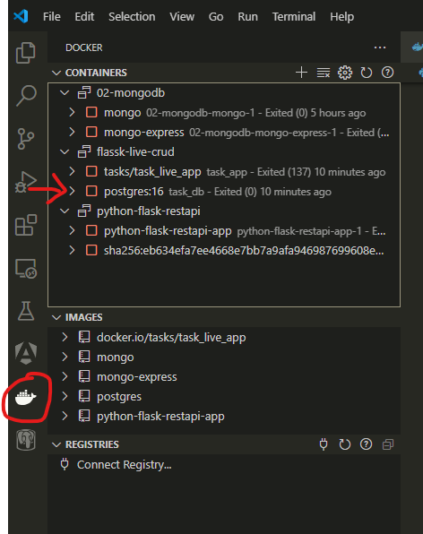
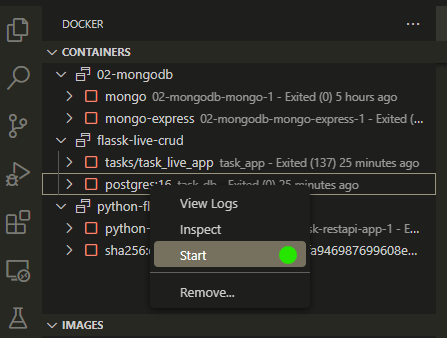

# Proyecto 1 Bases de datos 2

<h2>Sistema de encuestas</h2>

<h3>Introducción</h3>

<p>Este proyecto consiste en el diseño e implementación de un sistema de encuestas backend utilizando tecnologías modernas como Docker, MongoDB, PostgreSQL, Redis y RestAPI. El sistema permitirá a los usuarios crear, publicar y gestionar encuestas con diversos tipos de preguntas, así como registrar y administrar listas de encuestados.
El objetivo principal es desarrollar una aplicación robusta que proporcione las siguientes funcionalidades:</p>
<ul>
  <li>	Autenticación y autorización de usuarios con diferentes roles (administrador, creador de encuestas, encuestado).</li>	
<li>Creación y configuración de encuestas con diferentes tipos de preguntas (opciones múltiples, texto libre, etc.).</li>
<li>Publicación y gestión de accesos a las encuestas para los encuestados.</li>
<li>Registro y administración de listas de encuestados, incluida la asignación a encuestas específicas.</li>
<li>Recolección de resultados de encuestas y generación de informes estadísticos. <li>
</ul>
<p>Este sistema estará basado en una arquitectura de microservicios utilizando contenedores Docker para garantizar la escalabilidad, la flexibilidad y la portabilidad. Se utilizarán bases de datos tanto no estructuradas (MongoDB para datos de encuestas) como estructuradas (PostgreSQL para datos de usuarios y relaciones) para garantizar un almacenamiento eficiente y adecuado de los datos.  </p>


<h3>Estado del proyecto</h3>
<p>El proyecto se encuentra actualmente finalizado. Se han completado todas las etapas de desarrollo y documentación, lo que incluye la implementación de la infraestructura de contenedores Docker, la integración con las bases de datos PostgreSQL, MongoDB y Redis, además se realizó la configuración de las APIs necesarias para la interacción con otras aplicaciones.</p>


<h2>Instalación</h2>
<ul>
  <li>Se abre el folder del proyecto en Visual Studio Code</li>
  <li>Se abre una nueva terminal y para ejecutar el programa se ingresa el siguiente comando en la terminal: docker compose up</li>
  <li>En caso de error debe reiniciar la base de datos de la siguiente manera:</li>
  <li> 1)En el lado izquierdo del VSCode seleccionar la imagen de docker y buscar la base de datos</li>
  <li></li>
  <li> 2)Dar click derecho e iniciar la base antes de correr el docker compose</li>
  <li></li>
 
</ul>

<h2>Uso</h2>
<h3>Obtener una lista de usuarios</h3>
<p>Para obtener una lista de todos los usuarios registrados en la base de datos, realiza una solicitud GET al endpoint /api/usuarios</p>
<p>GET /api/usuarios</p>


<h3>Crear un nuevo usuario</h3>
<p>Para crear un nuevo usuario, envía una solicitud POST al endpoint /api/usuarios con los datos del usuario en formato JSON, incluyendo el nombre de usuario y la contraseña. Ejemplo:</p>
<p>POST /api/usuarios
	Ejemplo de datos JSON:</p>

 ```ruby
{
    "nombre":"Lucy Bronze",
    "email":"lucyBronze2@ejemplo.com",
    "password":"123",
    "rol": 1
}
```

<h3>Iniciar sesión</h3>
<p>Para iniciar sesión, envía una solicitud POST al endpoint /auth/login con las credenciales del usuario en formato JSON. Ejemplo:</p>
<p>POST /auth/login
	Ejemplo de datos JSON:</p>
 
 ```
{
    "email": "lucyBronze@ejemplo.com",
    "password": "123"
}
```

<h3>Obtener una lista de usuarios</h3>
<p>Para obtener una lista de todos los usuarios registrados en la base de datos, realiza una solicitud GET al endpoint api/usuarios.</p>
<p>GET /api/usuarios</p>

<h3>Obtener detalles de un usuario especifico</h3>
<p>Para obtener los detalles de un usuario especifico registrado en la base de datos, realiza una solicitud GET al endpoint api/usuarios/{id} </p>
<p>GET /api/usuarios/{id} </p>

<h3>Actualizar la información de un usuario</h3>
<p>Para actualizar los detalles de un usuario especifico registrado en la base de datos, realiza una solicitud PUT al endpoint api/usuarios/{id} </p>
<p>PUT /api/usuarios/{id} </p>
<p>Ejemplo de datos JSON:</p>

 ```
{
    "nombre":"Lucy Bronze",
    "email":"lucyBronze2@ejemplo.com",
    "password":"123",
    "rol": 1
}
```

<h3>Cerrar sesión</h3>


 
 

 


